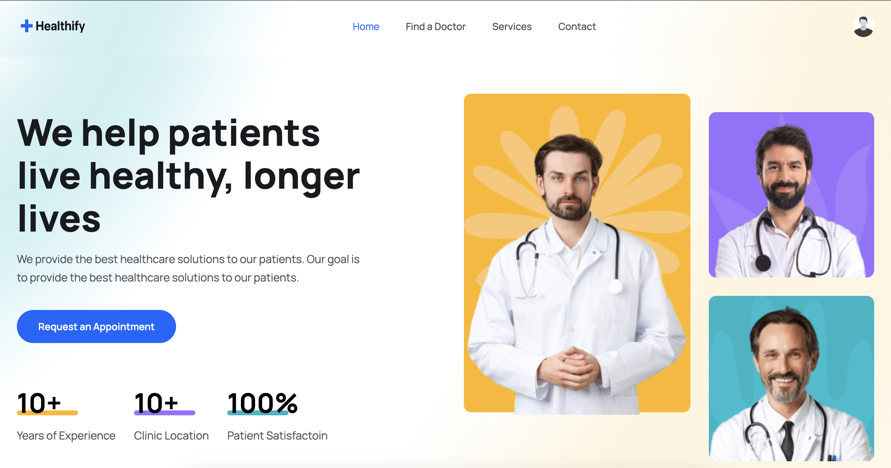
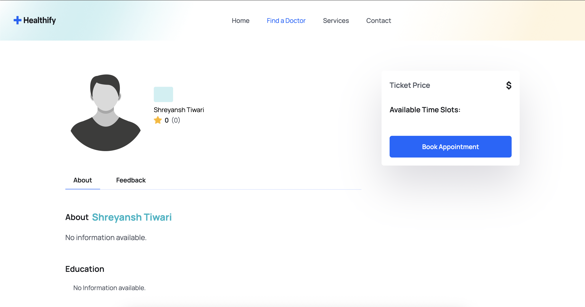
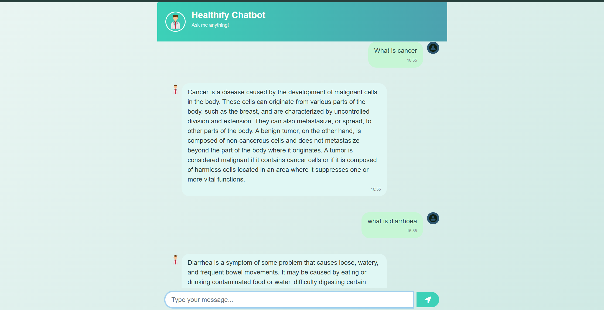

# Healthify

**Healthify** is a comprehensive healthcare platform that connects patients with doctors, featuring AI-powered medical chat, appointment booking, secure payments, and multi-role dashboards.

## Features

- **Healthcare Booking Platform**: Search doctors, book appointments, and pay securely via Stripe.
- **AI Medical Chatbot**: Real-time chat for medical questions, referencing medical literature with source tracking.
- **Multi-Role Dashboards**: Separate dashboards for patients, doctors, and admins.
- **Authentication & Reviews**: Secure JWT authentication, role-based access, patient reviews, and admin approval workflows.

## Screenshots

> _Add screenshots here (e.g., `/client/public/screenshot1.png`)_
- 
- 
- 
- 
- 

## Getting Started

### Prerequisites

- Node.js
- MongoDB
- Stripe account (for payments)
- Cloudinary account (for image uploads)

### Installation

```bash
git clone https://github.com/shreyanshtiwari4/Healthify.git
cd Healthify
# Install server dependencies
cd server
npm install
# Install client dependencies
cd ../client
npm install
```

### Environment Setup

- Configure your `.env` files in `server/` and `client/` with MongoDB, Stripe, and Cloudinary credentials.

### Running the App

```bash
# Start backend
cd server
npm start

# Start frontend
cd ../client
npm run dev
```

### Medical Chatbot Installation & Run Guide

#### Prerequisites

- Python 3.8+
- (Optional) Pinecone API key for vector database

#### Installation

```bash
cd Medical-Chatbot
python3 -m venv venv
source venv/bin/activate
pip install -r requirement.txt
```

#### Environment Setup

- Create a `.env` file in `Medical-Chatbot/` with your Pinecone and OpenAI/HuggingFace API keys as needed.

#### Running the Chatbot

```bash
python app.py
```

Then open [http://localhost:8080](http://localhost:8080) in your browser to use the medical chatbot.

## Usage

- Register as a patient or doctor.
- Search for doctors and book appointments.
- Use the chatbot for medical queries.
- Admins can approve doctors and manage users.

## Technologies Used

- **Frontend**: React, Vite, Tailwind CSS
- **Backend**: Node.js, Express, MongoDB, Mongoose
- **Payments**: Stripe
- **Image Uploads**: Cloudinary
- **Authentication**: JWT
